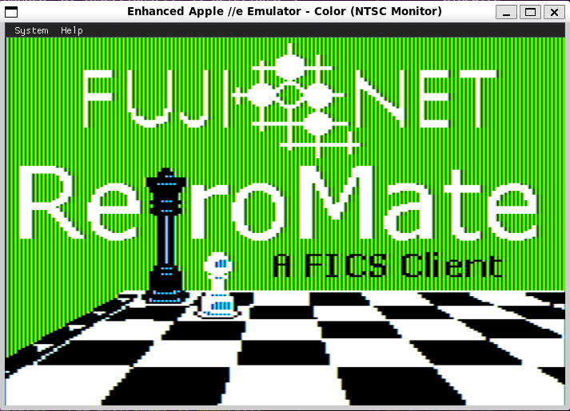
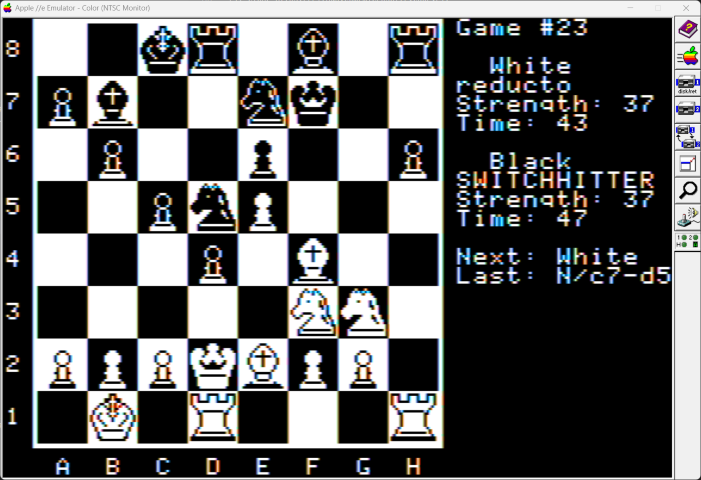
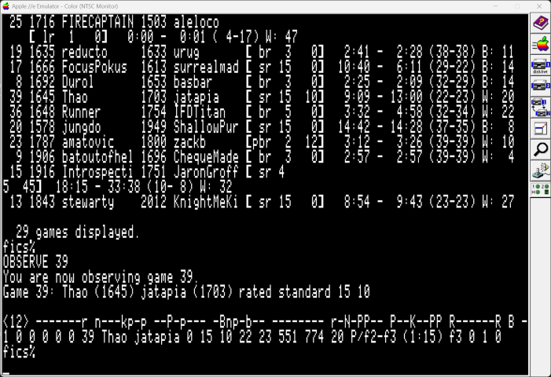
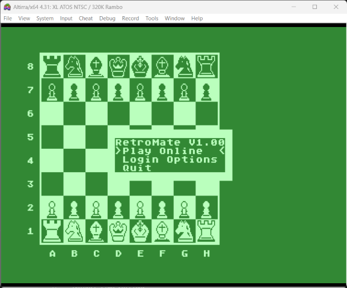
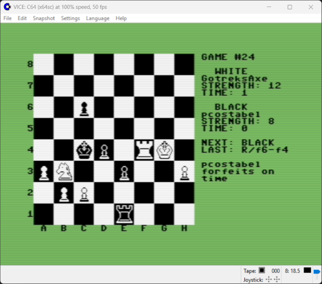
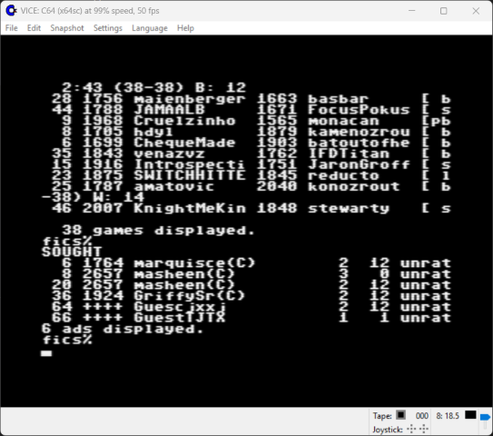

# FujiNet-RetroMate
This is a fork of [RetroMate](https://github.com/StewBC/retromate) for use with 
[FujiNet](https://github.com/FujiNetWIFI) network adapters.


## Code & Development  
The original Apple II, Atari, and C64 versions were created by Stefan Wessels with `cc65` and written mostly in C. The high-resolution drawing code - originally created in 6502 assembly, by Oliver Schmidt, for `cc65-Chess` is reused here.


## What is FICS, the Free Internet Chess Server?  
FICS is a free chess matchmaking service hosted at `freechess.org:5000` using Telnet. Log in using `guest` as the user and type `help` to explore. FICS supports a variety of game modes (standard, blitz, crazyhouse, wild, suicide, etc.). You’ll find several bots to play against, and human players are usually online as well.


## Platforms  
As of 10 December 2025, FujiNet-RetroMate runs on:
- Atari 8-bit computers with at least 48K RAM.

Apple II, Commodore 64 and other FujiNet retro computers to follow.


## Requirements: Hardware / Emulators  
This project uses FujiNet, so you’ll need a FujiNet device, or an emulator with FujiNet support. 


Recommended emulators for FujiNet

- Atari: [Altirra](https://www.virtualdub.org/altirra.html) and [Atari800](https://github.com/atari800/atari800)
- Apple: [AppleWin](https://github.com/FujiNetWIFI/AppleWin)


## Using RetroMate  

### Offline Menu  
Before connecting:
- Set your FICS account and password (or use a guest account - default).
- Optionally, configure a different server or port.

### Game Setup  
Choose from several game types:
- **Standard, Blitz, Lightning, Untimed**: Classical chess with varying time controls.  
- **Crazyhouse, Suicide, Wild (0–5, 8, 8a, fr)**: Chess variants.

**Settings:**
- **Rated**: Available to registered users. Set to "Yes" to play rated games.  
- **Use Sought**: If "Yes", look for existing opponent requests. If "No", the game sends a new seek request with the following options:  
  - **Start Time**: Minutes on your clock at game start.  
  - **Increment Time**: Seconds added after every move.  
  - **Min/Max Ratings**: Try to find players within this skill range.  

_Default time settings:_
- Standard: 15+0  
- Blitz: 5+2  
- Lightning: 2+2  
- Others: 3+0  

> Note: For Wild 0 and 1, castling must be done in the terminal using `o-o` or `o-o-o`.

### Terminal View  
Use the menu or press `TAB` or `CTRL+T` to switch to the Telnet terminal. Here you can use FICS commands directly. Press `ESC`, `TAB`, or `CTRL+T` to return to the game board.

#### Useful Terminal Commands  
- `finger`: View your account info (e.g., GuestXXXX)  
- `match <user>`: Challenge a specific user  
- `games`: List all active games  
- `observe <game#>`: Watch a game in progress  
- `unobserve [game#]`: Stop watching a game  
- `resign`, `abort`: Resign or request abort  
- `say <text>`: Send message to your opponent  
- `sought`: View active seeks  
- `seek [params]`: Advertise a new game request  
- `refresh`, `logout`, `help [subject]`  

RetroMate is stateless - you can, for example, observe multiple games at once (not practical, but supported).

## Chess Board Controls  
- Use arrow keys or WASD to move the cursor  
- `RETURN`: Select a piece and confirm move  
- `CTRL+S`: Say something to your opponent  
- `ESC`: Show/hide the menu  
- `TAB` or `CTRL+T`: Toggle to/from terminal

Even when it’s not your turn, you can select a piece to prepare your move - useful for fast games.

**UI indicators:**
- Shows players' names and sides/colors
- "Next" = who moves next  
- "Last" = last move made  
- Status updates (from e.g., say, resign, checkmate) appear below "Last:"


## Building FujiNet-RetroMate  
FujiNet RetroMate is built with [MekkoGX](https://github.com/FozzTexx/MekkoGX)

### Atari build instructions

The [FujiNet wiki](https://fujinet.online/wiki/?p=Development-Env-for-Apps) has some
setup instructions for development environments

1. Install dependencies


Fedora 43:
```bash
sudo dnf install make gcc  atasm clang++
```

Ubuntu 24.04:
```bash
sudo apt install git make gcc clang zlib1g-dev curl
```
*Note* you can probably get by with g++ instead of clang++. I'm using 
clang++ based on the on the FujiNet wiki `dir2atr` instructions.


2. Get the latest cc65

```c
git clone https://github.com/cc65/cc65.git
cd cc65
make
sudo make avail
```


3. build  dir2atr

Ubuntu does not appear to have an atasm package so build it:
```bash
git clone https://github.com/CycoPH/atasm
cd atasm/src
make
sudo make install  #  You may see an error for /usr/local/doc/atasm. This can be ignored
```
The main thing is to get `atasm` in your `${PATH}`


```bash
git clone https://github.com/FujiNetWIFI/fujinet-build-tools

cd fujinet-build-tools/AtariSIO/tools

make -f Makefile.posix CXX=clang++

sudo cp dir2atr /usr/local/bin

```

4. Clone and build fujinet-retromate

```bash
git clone https://github.com/radioation/fujinet-retromate.git
cd fujinet-retromate
make
```
If successful an `.atr` file will created  at `r2r/atari/fn_retromate.atr`


## Screenshots

### Apple II  




### Atari 800(48K)/XL/XE



### Commodore 64  




